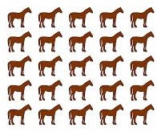

	

There are 25 mechanical horses and a single racetrack. Each horse completes the track in a pre-programmed time, and the horses all have different finishing times, unknown to you. You can race 5 horses at a time. After a race is over, you get a printout with the order the horses finished, but not the finishing times of the horses. What is the minimum number of races you need to identify the fastest 3 horses?
