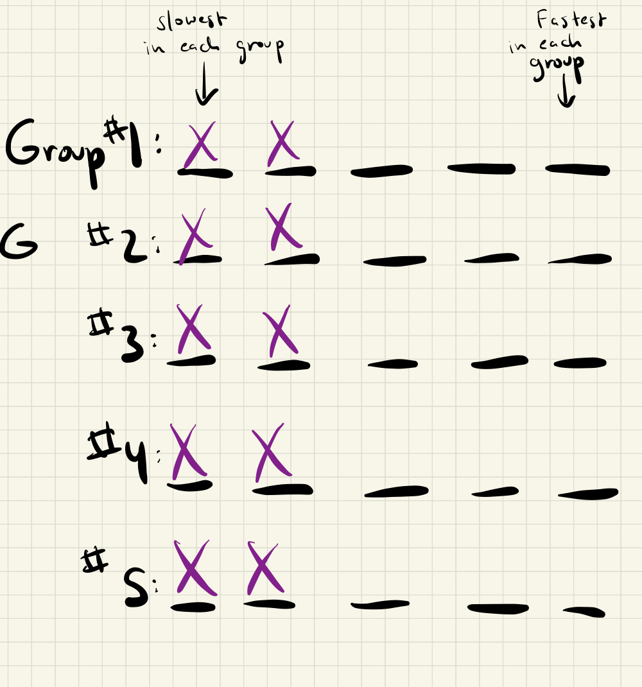

7 races.

Races 1-5: Partition the horses into groups of 5 and race each group.  This takes 5 races in total.

After that, you know the relative ordering of the horses within each
group of 5.  Arrange each group from fastest to slowest, like so:

	

We can now elimiate the slowest 2 horses in each group, since they could not possibly be in the fastest 3 horses overall.

Race 6:  Race the fastest horse in each group, like so:

	

Without loss of generality, we can assume the fastest horse was in group #1, the second fastest was in group #2, etc.

We can now eliminate more horses:

	

Race 7:  For the last race, race all the remaining horses except for the very fastest horse (which we alraedy know, since the winner of race 6 must be the fastest overall), like so:

	

Picking the fastest two horse from race 7, along with the fastest horse overall, we can deduce the fastest 3 horses.

