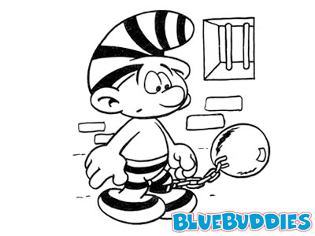

In a small village in the middle of nowhere, three innocent prisoners, A, B, and C, are sitting in a jail. One day, the cruel jailer takes them out and places them in a line on three chairs, in such a way that man C can see both man A and man B, man B can see only man A, and man A can see none of the other men. The jailer shows them 5 hats, 2 of which are black and 3 of which are white. After this, he blindfolds the men, places one hat on each of their heads, and removes the blindfolds again. The jailer tells his three prisoners that if one of them is able to determine the color of his hat within one minute, all of them are released. Otherwise, they will all be executed. None of the prisoners can see his own hat, and all are intelligent. After 59 seconds, man A shouts out the (correct) color of his hat!
