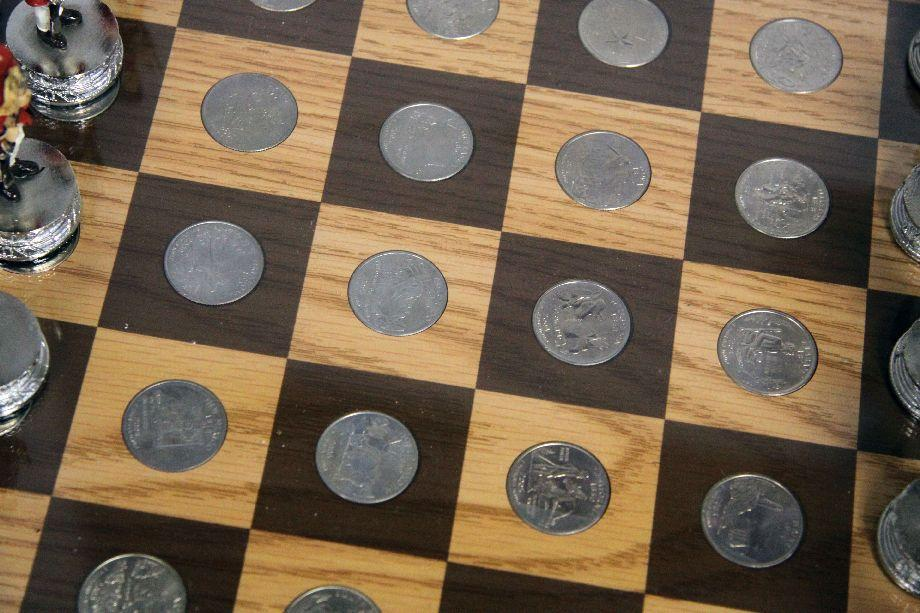

Unsurprisingly, this question involves a perverse jailer and two prisoners hoping to gain their freedom.

The jailer has devised the following game:

Prisoner #1 will enter, alone, into a room, where he will find a standard 8x8 chess-board.  On each square, there will be a (standard) quarter.  He will be forced to flip over a single quarter and then leave the room.

Next, prisoner #2 will enter the same room, alone.  He gets the opportunity to point to a single quarter.  If he points to the quarter that prisoner #1 flipped, both prisoners survive.  Otherwise... you know the drill.

What's the best strategy?  How likely are they to survive?

