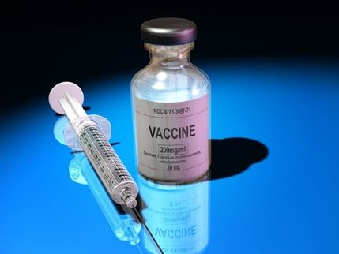

A pharmaceutical company is producing a serum to cure rabies. They have produced 1000 numbered bottles of the serum. However, they have learned that one of the bottles was contaminated with a radioactive chemical. Any amount of this serum will be fatal to any living creature within 7 days of injection. Further complicating things, they must ship the serum in 7 days.
Fortunately, the company has a supply of lab mice. What is the smallest number of mice needed to determine which bottle is contaminated?
