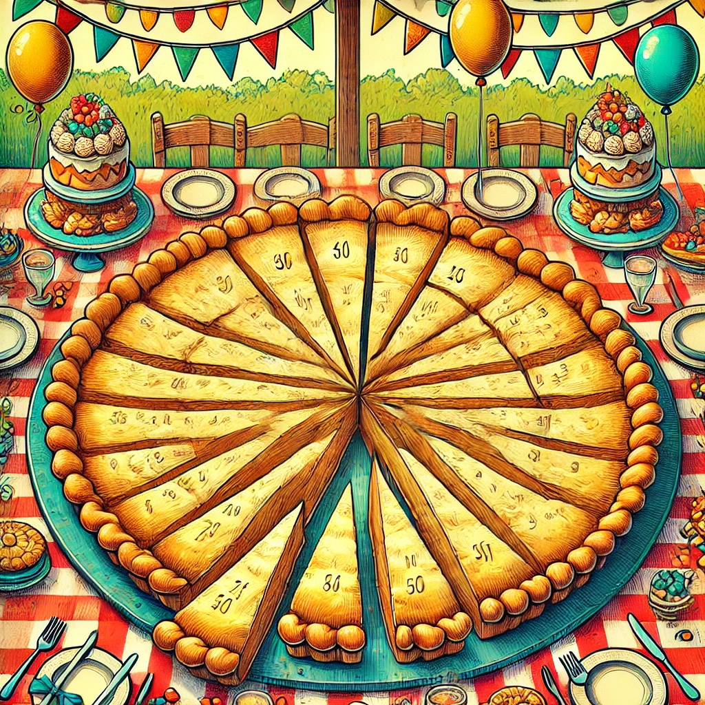

A gigantic pie is shared among 100 guests. The first guest gets 1% of the pie.
The next gets 2% of what's left. The 3rd gets 3% of what's left. All the way
to the last guest who gets 100% of what's left.

Who gets the biggest piece of pie?

No computers or calculators allowed! (pencil and paper is fine)
