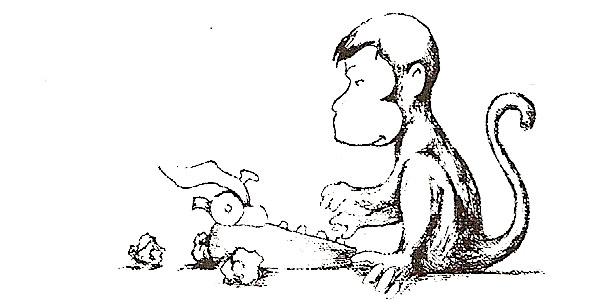

George, a particularly curious monkey, finds a typewriter and starts (randomly) typing at a rate of 1 letter/second.  George is 2 at the time.  Assuming he doesn’t get any better at typing, what is George’s expected age before he types the word abracadabra?

P.S.  Assume typewriter has all 26 letters, lowercase only.
