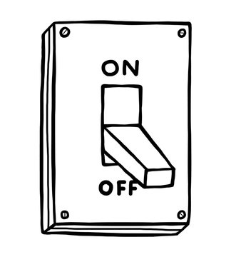

In front of you are 6 light switches, all of which are in the off position.  On each turn of this "game", you roll a standard 6-sided die and toggle the switch corresponding to the die roll.  For example, if you rolled a 4, you toggle the 4th switch.  If it was already in the off position, then you switch it on, and if it was in the on position, then you switch it off.

What is the expected number of turns until all 6 switches are in the on position for the first time?
