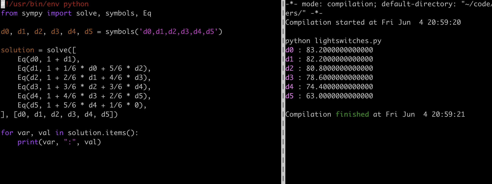

Let's declare 6 variables:

- $$d0$$ is the expected number of turns until all 6 switches are on when 0 switches are on
- $$d1$$ is the expected number of turns until all 6 switches are on when 1 switch is on
- $$d2$$ is the expected number of turns until all 6 switches are on when 2 switches are on
- $$d3$$ is the expected number of turns until all 6 switches are on when 3 switches are on
- $$d4$$ is the expected number of turns until all 6 switches are on when 4 switches are on
- $$d5$$ is the expected number of turns until all 6 switches are on when 5 switches are on

We can then construct the following system of equations:

$$
\begin{align*}
d0 &= 1 + d1 \\
d1 &= 1 + 1/6 \cdot d0 + 5/6 \cdot d2 \\
d2 &= 1 + 2/6 \cdot d1 + 4/6 \cdot d3 \\
d3 &= 1 + 3/6 \cdot d2 + 3/6 \cdot d4 \\
d4 &= 1 + 4/6 \cdot d3 + 2/6 \cdot d5 \\
d5 &= 1 + 5/6 \cdot d4 + 1/6 \cdot 0 \\
\end{align*}
$$

Since I'm lazy, I just asked python to solve them for me:

The answer we are looking for is $$d0$$ which is 83.2.
