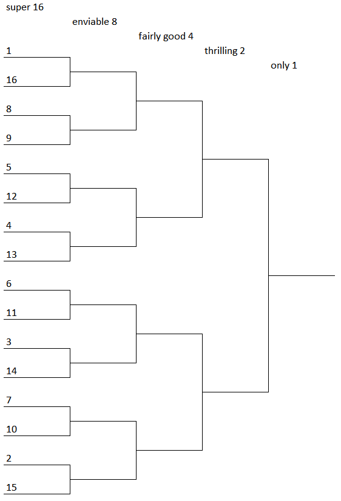

	

There’s a certain insanity in the air this time of the year that gets
us thinking about tournament brackets. Consider a tournament with 16
competitors, seeded 1-16, and arranged in the single-elimination
bracket pictured above (identical to a “region” of the NCAA Division 1
basketball tournament). Assume that when the X-seed plays the Y-seed,
the X-seed has a Y/(X+Y) probability of winning. E.g. in the first
round, the 5-seed has a 12/17 chance of beating the 12-seed.

Suppose the 2-seed has the chance to secretly swap two teams’
placements in the bracket before the tournament begins. So, for
example, say they choose to swap the 8- and 16-seeds. Then the 8-seed
would play their first game against the 1-seed and have a 1/9 chance
of advancing to the next round, and the 16-seed would play their first
game against the 9-seed and have a 9/25 chance of advancing.

What seeds should the 2-seed swap to maximize their (the 2-seed’s)
probability of winning the tournament, and how much does the swap
increase that probability? Give your answer to six significant
figures.
