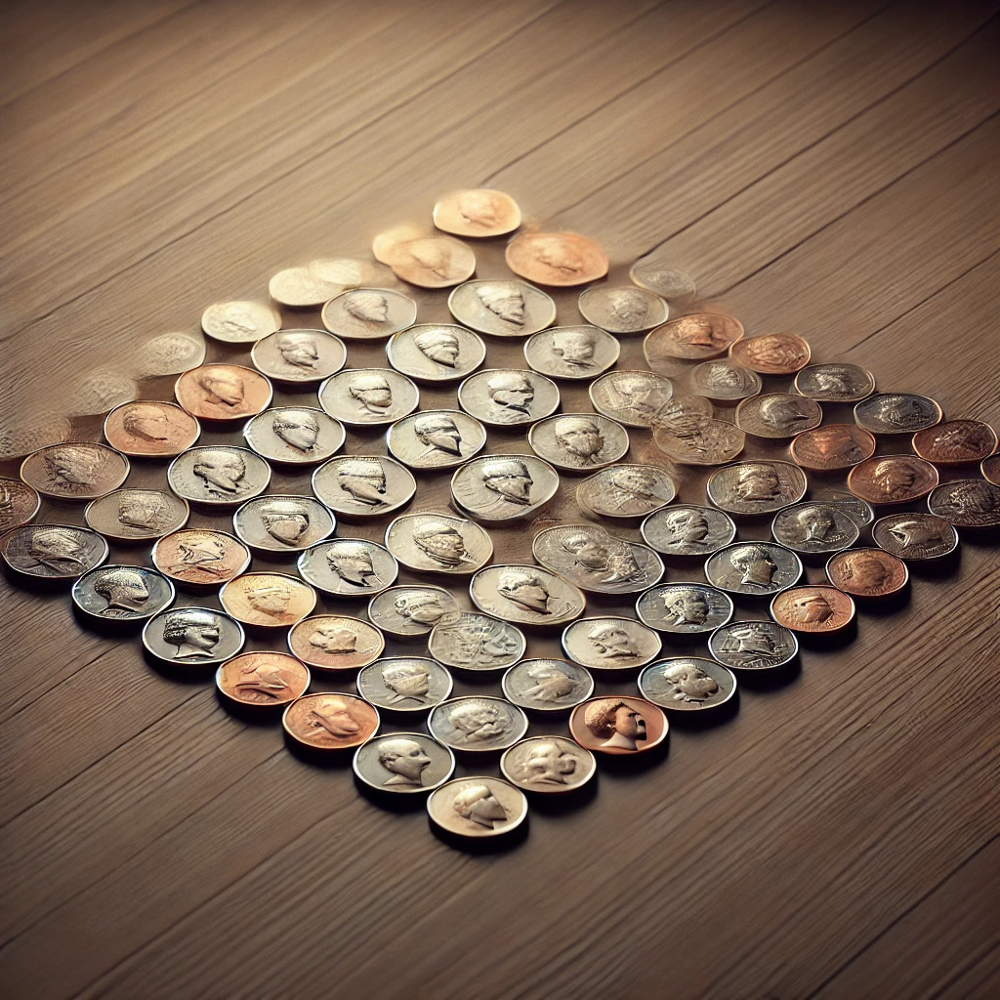

There are 100 coins on a table; each coin has a heads side and a tails side. There are 10 heads and 90 tails showing. You cannot see the coins or feel for which side is facing up. Your mission, should you choose to accept it, is to divide the coins into 2 piles so that both piles have the same number of heads.
