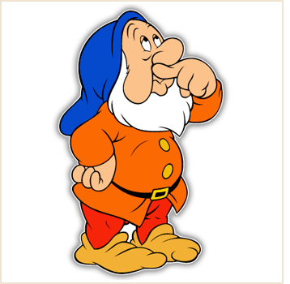

In a distant, dark forest, lives a population of 400 highly intelligent dwarfs. The dwarfs all look exactly alike, but only differ in the fact that they are wearing either a red or a blue hat. There are 250 dwarfs with a red hat and 150 dwarfs with a blue hat. Striking however, is that the dwarfs don't know these numbers themselves and that none of them knows what the color of his hat is (there are for example no mirrors in this forest). But the dwarfs do know that there is at least one dwarf with a red hat.

During a certain period of their year, there is a big party in this village, to which initially all dwarfs will go. However, this party is only intended for dwarfs wearing a blue hat. Dwarfs with a red hat are supposed never to return to the party again, as soon as they know that they are wearing a red hat.

How many days does it take before there are no more dwarfs with a red hat left at the party?
