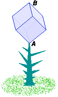

In the planet Gnirica grows the peculiar cube plant (cubus vulgaris gniricae). On the perfect cubical flower of this plant, the cube creature (ambulator cubi gniricae) lives. This creature is born at the bottom of the flower (point A), and his whole life it walks along the sides of the cubical flower. The cube creature walks one whole side in one year, and if it arrives in a vertex, it chooses a new direction (it can also decide to walk back along the same side it came from). As soon as the cube creature arrives at the top of the cubical flower (point B), it dies. Consequently, cube creatures live at least three years.

What age do cube creatures reach on average?
