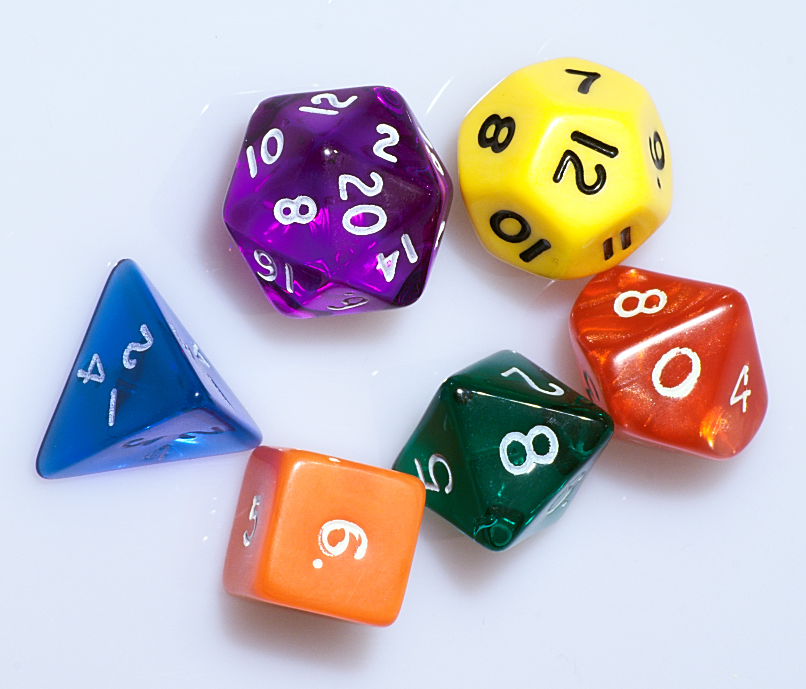

Imagine that you have set of 13 dice.  The number of sides on each die corresponds to a prime number less than 42.  So, using the convention that "dn" means a die with "n" sides (all with equal probability), your set of available dice are:

d2, d3, d5, d7, d11, d13, d17, d19, d23, d29, d31, d37, and d41

Your goal is to simulate the roll of a d42 using the set of avilable dice *in the least number of expected rolls*.

For example, your strategy could be as follows:

You can represent a number between 1 and 64 in binary using 6 bits.  Roll a d2 6 times to produce those 6 bits.  If your resuling binary number is <= 42, then stop and treat that as the outcome of the d42.  Otherwise, repeat this process.

The expected number of rolls this would take is $$\frac{6}{42/64}$$ which is a little over 9 rolls.

