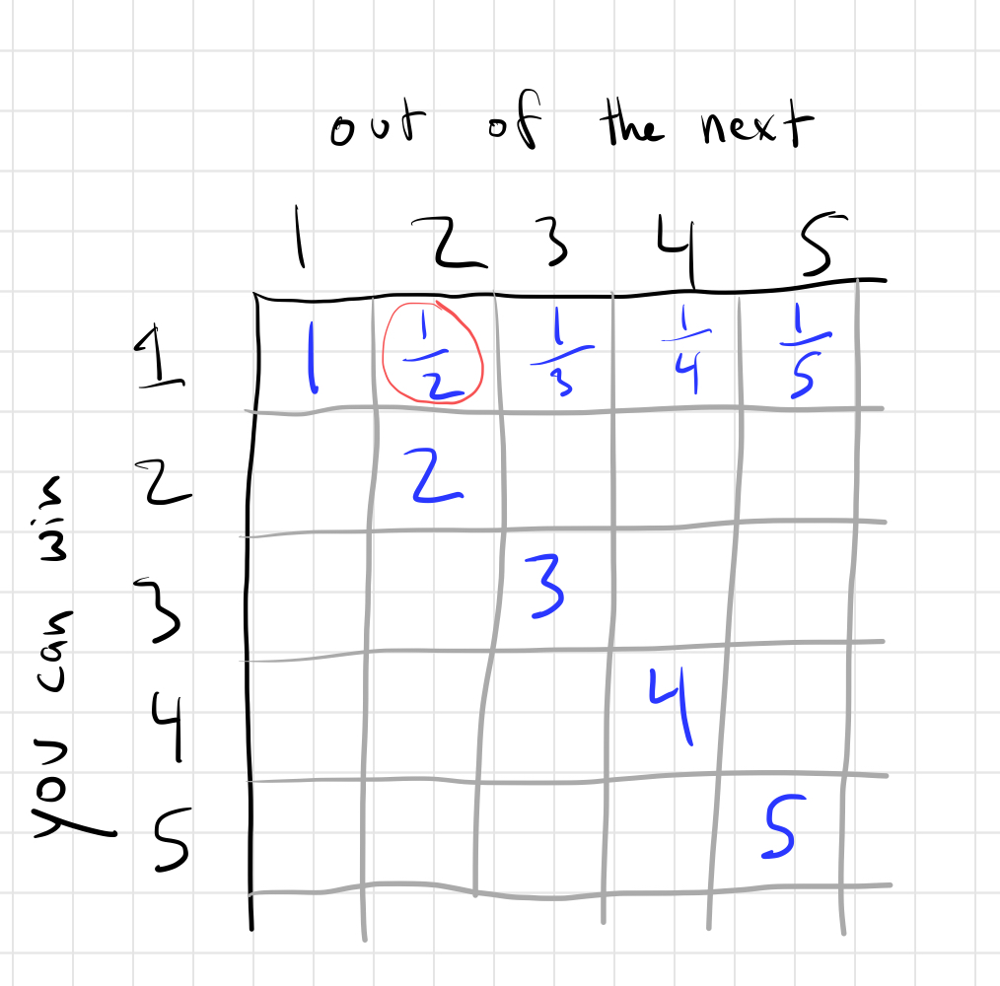
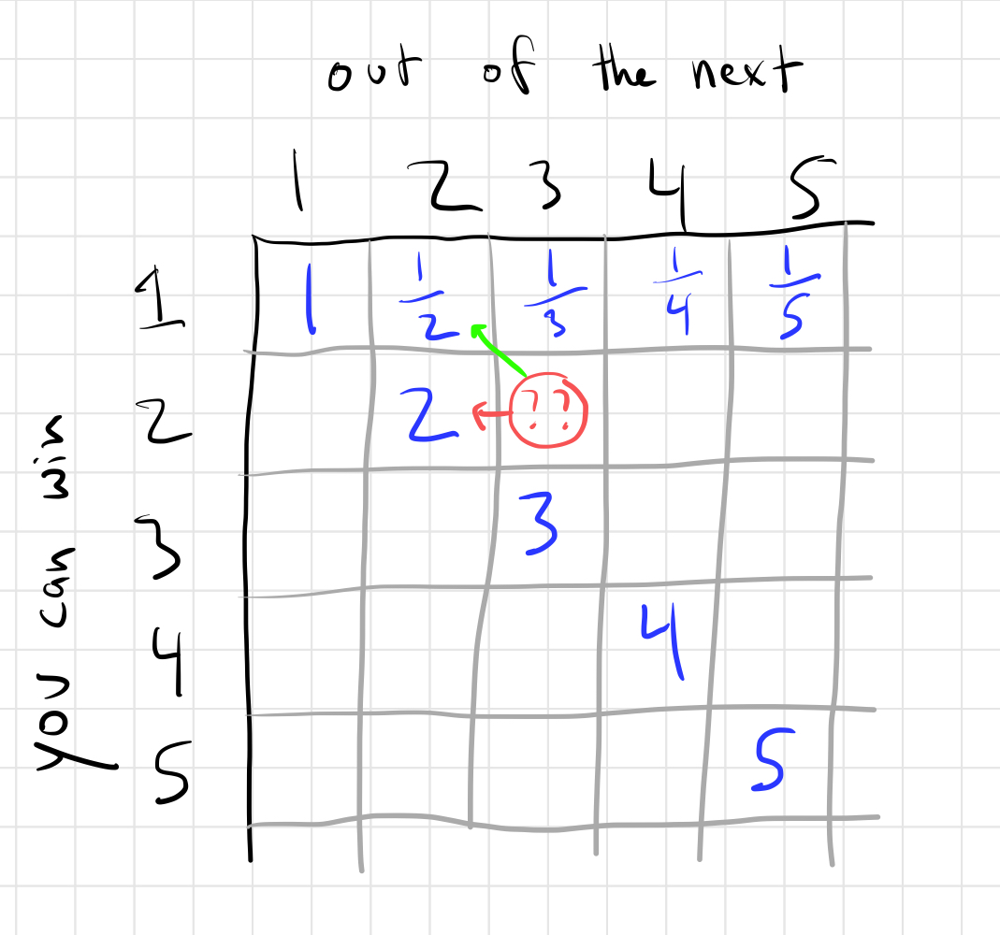
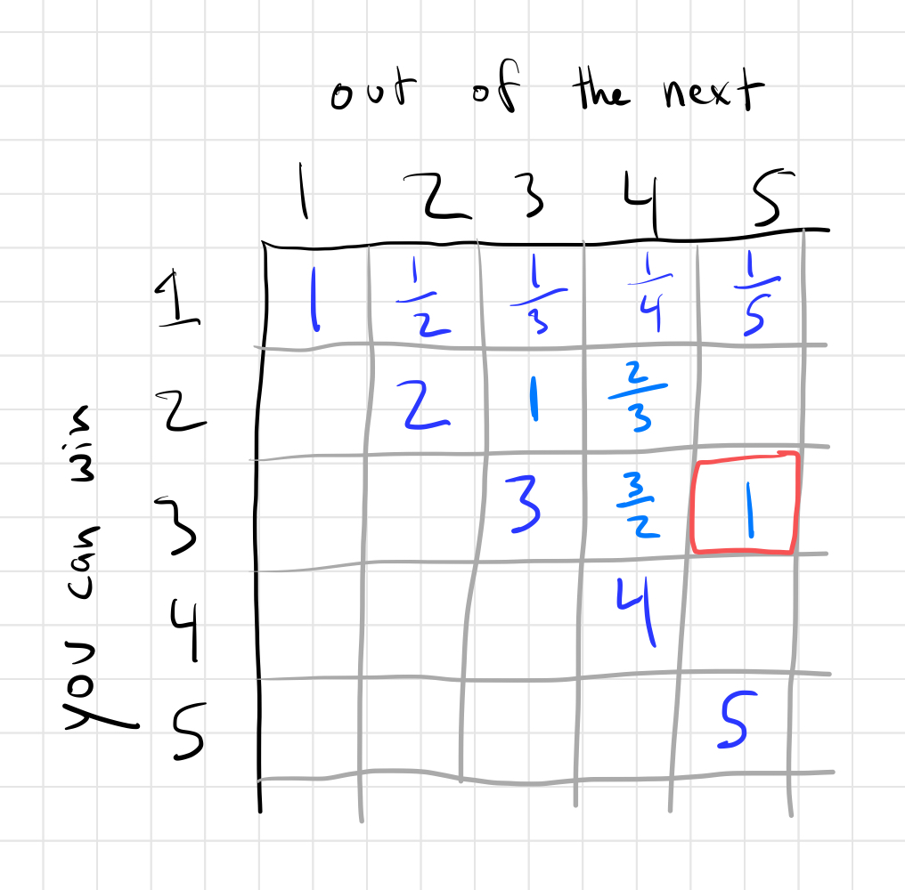

This was not an easy problem but it was really satisfying in the end.
If you haven't solved it, I highly suggest you keep trying before
reading the solution.

I did two things to get a feel for this problem. First, instead of
needing to win 3 of 5 silver hexagons, I simplified the problem to
needing to win 2 of 3. The other thing I did was just play around
with example scenarios _a lot_. I didn't have an amazing idea of
where to start in the beginning so I just picked arbitrary decisions
to start just to see where they would lead.

Eventually, some rules became clear, such as:

- If you have more gems than your rival, you can win the next hexagon

That one is pretty obvious!

- If you have 1/2 the gems of your rival, you can guarantee winning 1 of the next 2 hexgons.

How? Well, you should just bid all your gems. If they're trying to prevent you from winning 1 of the next 2, they can't let you win, so they need to match or beat your bid (depending on who will win the next tie). Let's assume they win ties and so they match your bid and win. Now you both have the same number of gems and you win ties so you'll win the next one.

- If you have more gems than your rival, you can win 2 of the next 3 hexagons.

In this case, you bid half your gems. If you win, then you're in the case above (you need to win 1 of the next 2 and you have 1/2 the gems of your rival -- more actually). So your rival can't let you win.

If they match your bid and, let's be generous, they win the tie, then you have _more than 2x their gems_. You can beat them on both next gems.

Eventually, I realized you can arrange these "rules" in a 2D grid, like so:

The number circled in red represents the fact that I can guarantee to win 1 of the next 2 if I have at least 1/2 as many gems as my rival.

Ok, so how do we fill in more squares, such as this one?

They key realization for me was that after the next auction, you will either move along the green arrow or the red arrow depending on whether you win or lose the auction, respectively.

To flesh that out in this example, let's say you want to win 2 of the next 3 hexagons. If you win the next hexagon, then you need to win 1 of the next 2 and we know you need at least 1/2 as many gems as your rival to do that. If you lose the next hexagon, then you need to win 2 of the next 2 hexagons and we know you need 2x (or really a bit more) as many gems as your rival to do that.

So how many gems do you need to win 2 of the next 3 hexagons? Well, if you have 1x as many and you bid 1/2 of them, if you win, you'll be in good shape. If you lose, then you'll have 2x as many as your opponent and again, you'll be in good shape.

You can continue filling out the grid like this!

So, in order to win 3 of the 5 gems, you need at least 1x as many gems as your rival. Actually you need a bit more becuase of ties -- I wasn't being very precise about ties in the analysis above.

## The answer

So, we now know that if we have more than 1x as many gems as our rival we can win 3 of the next 5 hexagons. So our new goal is to come out of the gold hexagon phase with more gems. We currently have 75 and our rival has 99.

Let's bid 25 gems to start. If our rival matches us, then perfect, they have 74 and we have 75. We will just bid 0 on the last gold hexagon.

If they don't match us, then we now have 50 and they have 99. Bid all your gems on the last gold hexagon! They can't let you win (otherwise, they immediately lose), so they need to bid 50. Again, they will come out with 74 and you'll come out with 75.
