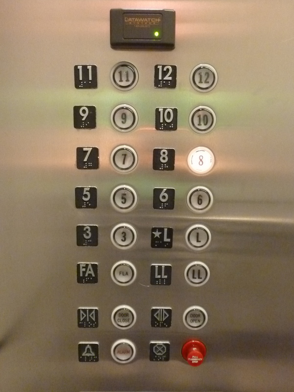

In a building’s lobby, some number (N) of people get on an elevator that goes to some number (M) of floors. There may be more people than floors, or more floors than people. Each person is equally likely to choose any floor, independently of one another. When a floor button is pushed, it will light up.

What is the expected number of lit buttons when the elevator begins its ascent?
