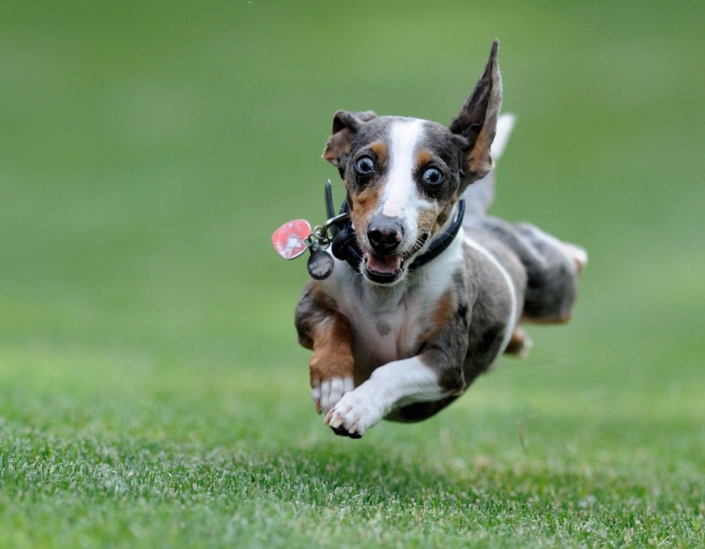

Two childhood friends, Bob and Sam, are in a dog park when they recognize each other from across the park.  They start 2 miles from one another (good eyesight...) and each start to run at each other at a speed of 5 MPH.

Bob’s dog, Scruffy, recognizes Sam as well and starts to sprint towards Sam at a speed of 25MPH.  Once Scruffy reaches Sam he immediately turns around and starts running back towards Bob, turning around once again when he reaches Bob, continuing this until Bob and Sam meet.

How far does Scruffy run?
