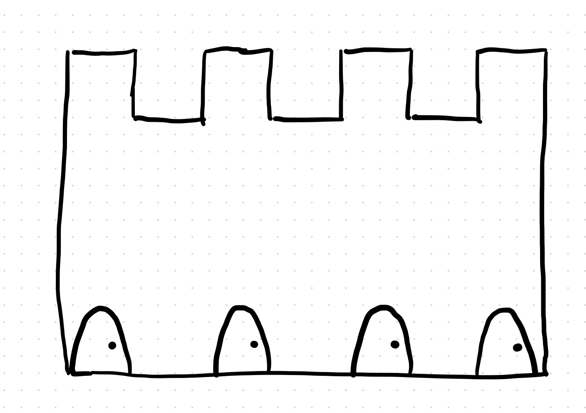

A flat (2-D) castle has 4 doors, each leading to a bedroom.  A very particular princess lives in the castle.  Each night, she sleeps in a bedroom but decides the next morning that it was not to her liking and moves to a different - but adjacent! - bedroom for the next night.

You're a noble knight hoping to find and marry this princess.  However, for reasons unbeknownst to me, you only arrive once per night, you check exactly one bedroom (of your choosing) to see if the princess is there, and if she's not - you leave.

How many nights will it take for you *guarantee* that you will find the princess (and what's your strategy)?

*Extension*: How many nights will it take you for a castle with $$n$$ doors?
