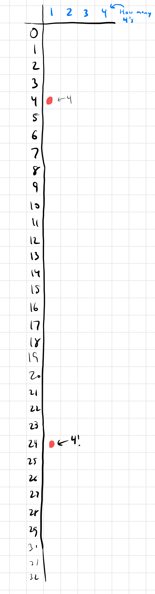
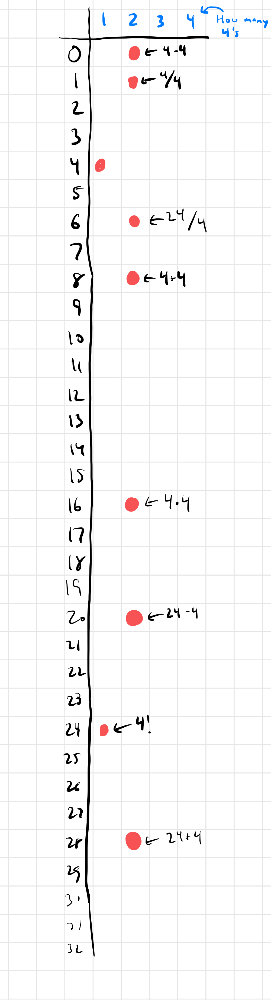
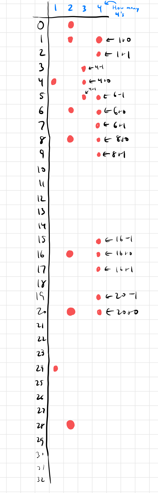
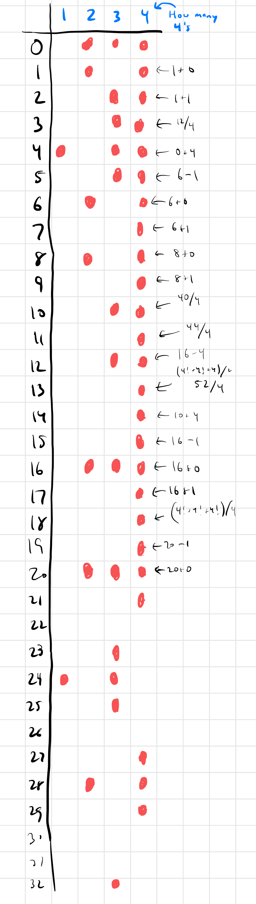

<link rel="stylesheet" href="styles.css" />

I thought this would be easier than it was, so at first my approach was disorganized: I was just trying to conjure up expressions that hit all the numbers from 1 - 20 using exactly 4 4s. But a few numbers eluded me (e.g. 10 & 13), so then I found a more methodical approach.

The key realization (at least for me) was whittling down the space of possible expressions by only keep track of what numbers I can make and using how many 4s. That doesn't sound very helpful, but let me demonstrate.

To start, we know we can make 4 using 1 4 (duh: just 4) and we can also make 24 using 1 4 (4!). I represent that fact by putting a red dot in the following two squares:

Now we can use that to make more red dots. If I can make 4 and 24 using 1 4, then I can make

- 0 using 2 4s: 4 - 4
- 1 using 2 4s: 4 / 4
- 6 using 2 4s: 24 / 4
- 16 using 2 4s: 4 \* 4
- 20 using 2 4s: 24 - 4
- 28 using 2 4s: 24 + 4

Armed with those red dots, we can make more. I won't list them all, but one example: Since I know I can make 16 and 0 each using 2 4s, then I can make 16 using 4 4s (16 + 0).

We've already made a whole bunch of the numbers between 1 and 4 using 4 4s. If we just keep working at it, we can make the rest:

And... because this is what I like doing... I decided to write a program to find _all_ the ways to make each of these boxes:

This grid represents the same thing as my pictures above. I use the notation 6_2 to mean the ability to make 6 using 2 4s. If you click on a green square, you'll see all the ways to make that square.

  

    <!-- The grid squares will be generated here by JavaScript -->
  

  

    <h2>Ways to Reach:</h2>
    
Click on a square to see the ways

  

