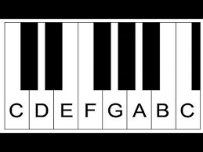

The song Do-Re-Mi has the following section:

> Now, children, Do-Re-Mi-Fa-So and so on
> Are only the tools we use to build a song
> Once you have these notes in your heads
> You can sing a million different tunes by mixing them up

How many different tunes *could* you make? 

Let's make some arbitrary choices so that this question has a precise answer:

- The entire song is 7 beats long
- Notes can be any integer number of beats long
- Let's limit the available notes to the 8 notes in Do-Re-Mi-Fa-So-La-Ti-Do
