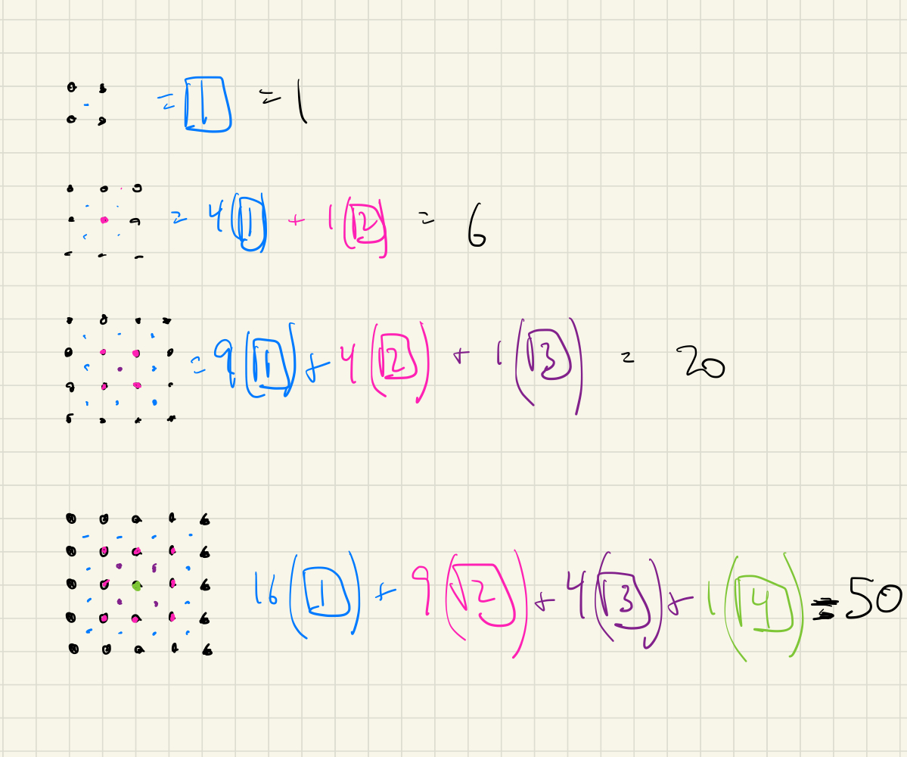

I love math.  There are so many ways to phrase [the answer to this question](https://oeis.org/A002415).  Here are a few.

$$
\begin{align*}

f(n) &= \frac{n^2(n^2-1)}{12} \\

f(n) &= \sum_{i=0}^{n} \sum_{j=0}^{i} j^2 \\

g(n) &= n \\
h(n) &= n^2 \\
f(n) &= g * h \\
\end{align*}
$$

where $$*$$ in the last formula represents the convolution operator.

I don't have enough time right now to fully explain the following diagram, but here's something in the way of a solution that most closely resembled the last formula (the convolution of the natural numbers and the square numbers).

