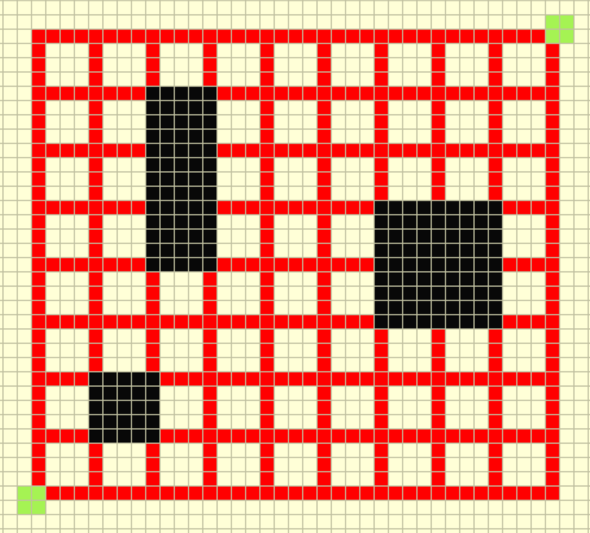

You need to travel from the bottom left to the top right (from green starting point to green ending point).  You can only move up or to the right along the red lines.  You *cannot* touch the black.

How many ways can you get from the bottom left ot the top right?
