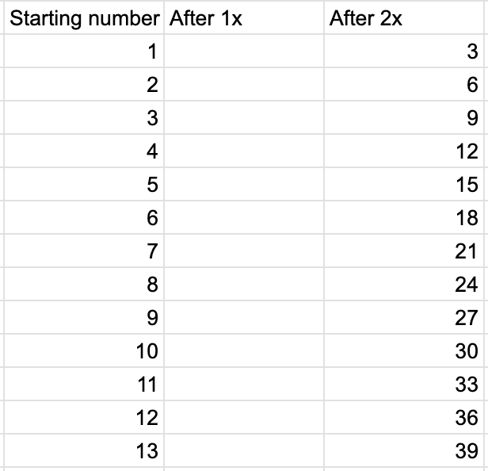
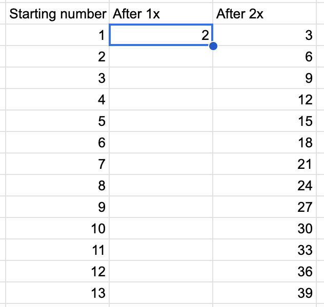
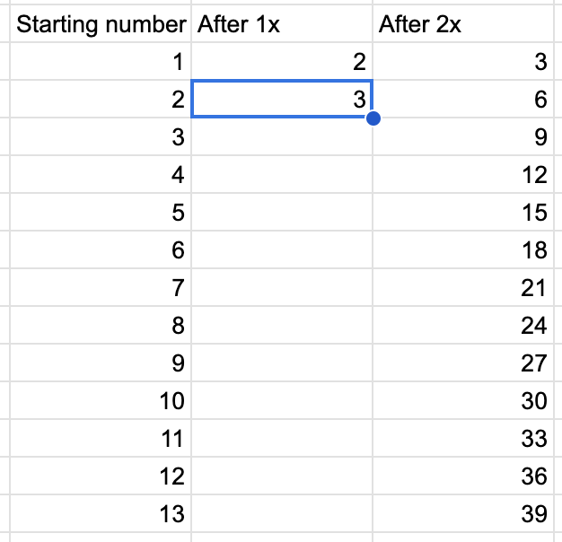
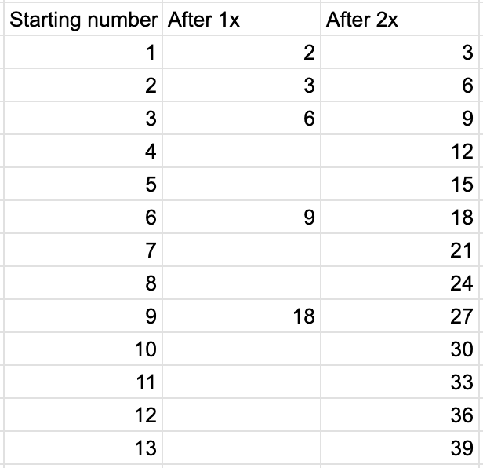
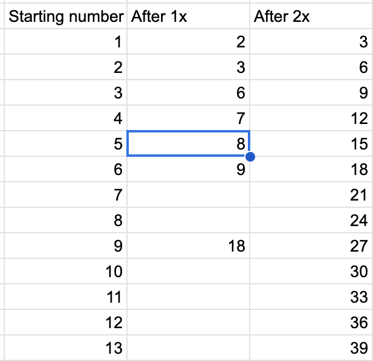
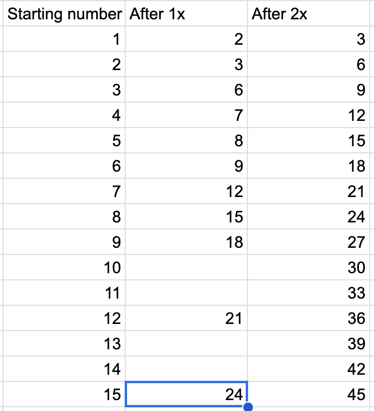
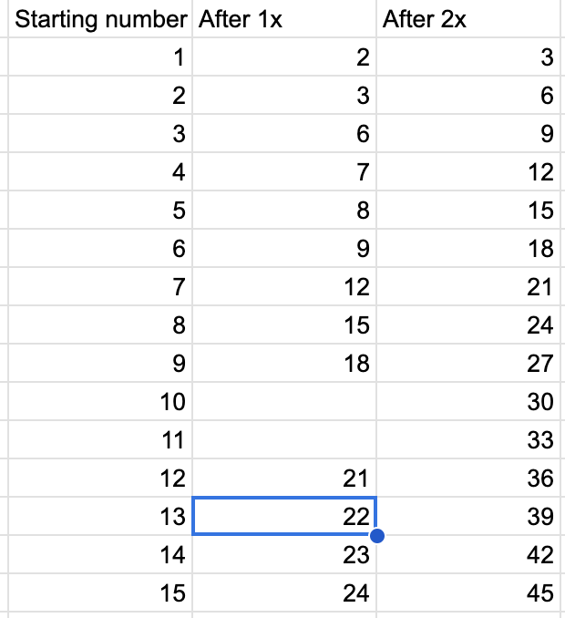

22

The way I solved it was by creating a spreadsheet and incrementally filling it out.

My sheet has 3 columns, one for the starting number of coins, one for what that becomes after applying the magic 1x, and one for what that becomes after applying the magic 2x.

It starts out looking like this:

Based on the rules, we know the bag always increases the number of coins, so, we can fill this one.

Which means we can fill in this one:

And so on:

Now it's not super obvious what to do, but notice that 4 and 5 must produce more coins than 3 and less than 6. 3 produces 6 and 6 produces 9, leaving only 7 and 8 as possibilities. Again, using the rule that more input coins produce more output coins, we can fill in 7 and 8 for 4 and 5, respectively.

And then we can follow the implications of those:

Just like before, 12 -> 21 and 15 -> 24. There are only 22 and 23 available and we have 2 spots, so we can fill them in:

And we have our answer! If you put 13 in, you get 22 out!
