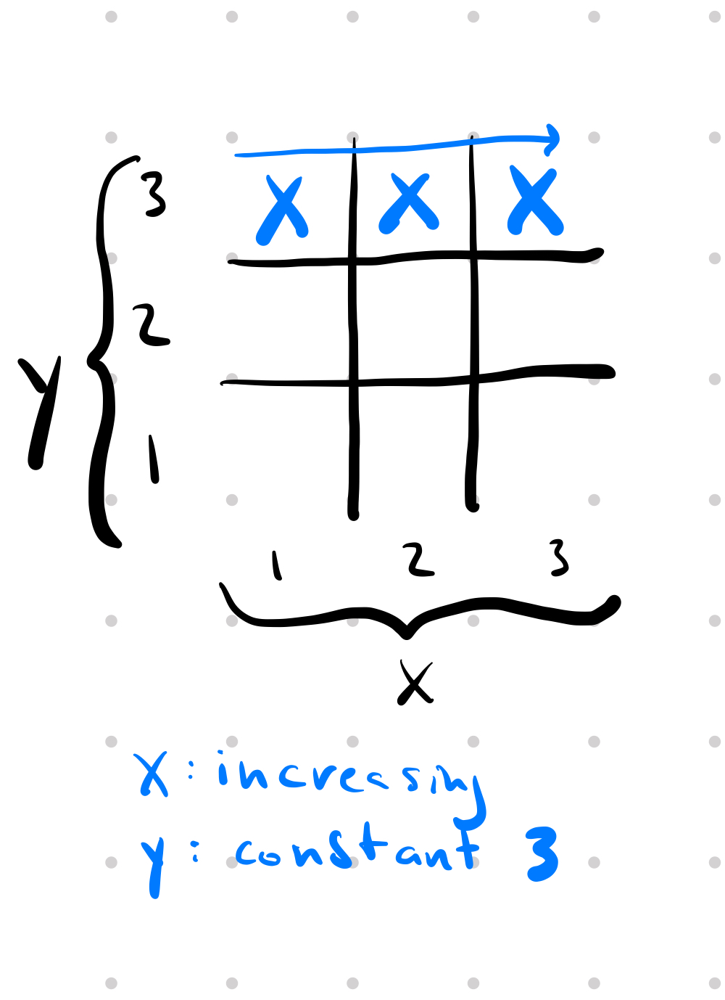
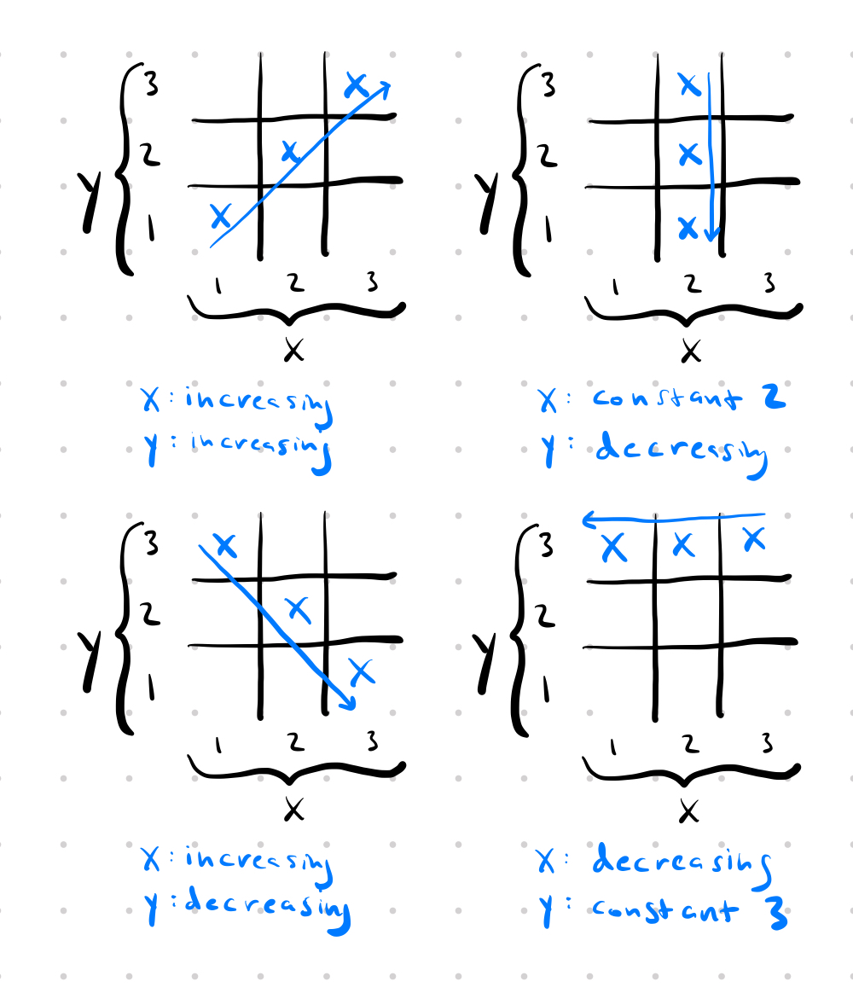
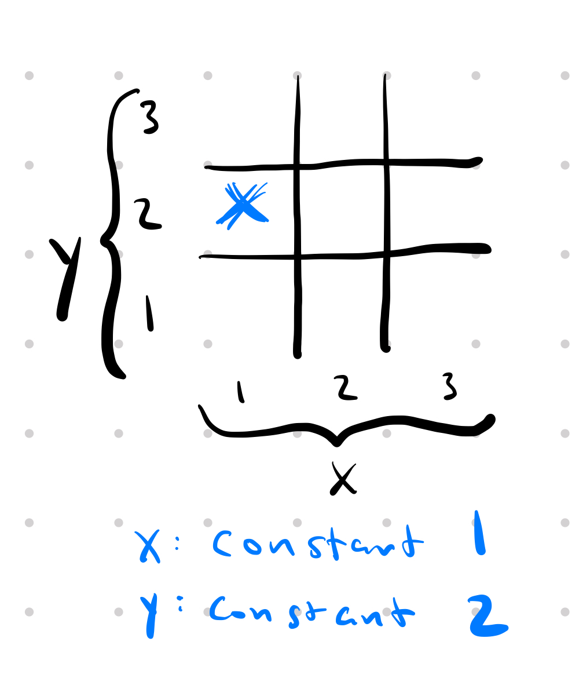
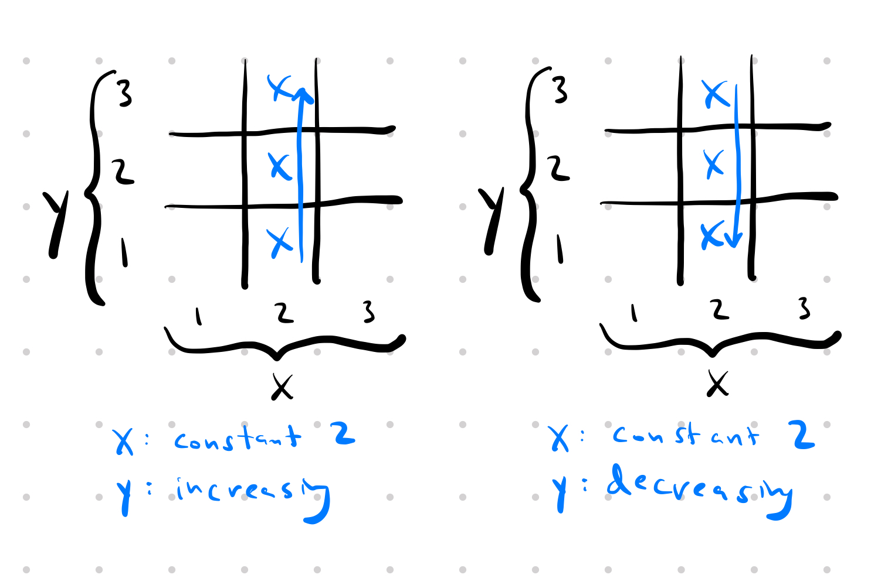

Update 2023-11-25: I found a new combinatorial way to think of the solution and I think it's my favorite so far.

## Combinatorial

Let's consider the 2D case since that's the easiest to visualize and work our way up from there.

In 2D, we have the x and the y dimension. For each winning line, if you only consider a single dimension, it can do one of 5 things:

- constant 1
- constant 2
- constant 3
- increasing
- decreasing

For example, here is the winning line where x is increasing and y is a constant 3.

Here are a few more winning lines, just so it's clear what I mean:

So we have 5 choices per dimension. We have 2 dimensions so our starting guess for how many winning lines will be 5 x 5 = 25.

But wait, some of these winning lines aren't valid. If all the dimensions are constant, that's not a valid tic-tac-toe winning line. At least one dimension must be increasing or decreasing -- otherwise you just get a single square. For example, here is the invalid winning line where x is constant 1 and y is constant 2.

Luckily there's a really easy way to count all the invalid winning lines. Each one corresponds to a single square in the 3x3 tic-tac-toe grid. So that's 9 invalid winning lines. Let's subtract them and we get: 25 - 9 = 16.

We're almost there. We need to make one last correction. We've counted each winning line twice. Consider the following winning line:

It can be described by either { x: constant 2, y: increasing } or { x: constant 2, y: decreasing }. Every single winning line has exactly 2 ways to describe it. So we need to divide our winning lines by 2.

$$\frac{25 - 9}{2} = 8$$

And that's correct!

Extending this to N-dimensions is actually really trivial. Each of N dimensions have 5 choices, but we need to subtract the $$3^N$$ hypercube since those are all the invalid winning lines where all of the dimensions are constant, and lastly we need to divide by 2. That leaves us with

$$
f(n) = \frac{5^n - 3^n}{2}
$$

## Recurrence

Let's try to define f(n) as a function of f(n-1).

Imagine starting with a $$3^1$$ "hypercube" (line) and trying to describe all the solutions in a $$3^2$$ "hypercube" (square). You can think of the $$3^2$$ as three separate layers of $$3^1$$ lines standing veritically, side by side, with each layer having all the normal $$3^1$$ solutions. From this, we get $$3 f(n-1)$$. This takes care of all solutions that look like a point when projected on to the new dimension. Another way of saying this is that all additional solutions will not be contained within a single $$3^{n-1}$$ "layer". In the $$3^2$$ example, this gives us our (3) vertical line solutions.

Consider all the ways that you can take a $$3^1$$ solution and stretch it across the new dimension. Well, it turns out that there are only two ways. You can take one end of the line, and pull it across the new dimension (which makes one diagonal solution in a $$3^2$$ square). Or you can do the same thing to the other end of the line. So, for each solution in $$3^{n-1},$$ there are two ways we can stretch it across the new dimension to make a new $$3^n$$ solution. From this, we get $$2 f(n-1)$$. In the $$3^2$$ example, this gives us our (2) diagonal line solutions.

There is one more case to consider. Lines (solutions) that utilize the new dimension (i.e. do not look like a point when projected on to the new dimension) but do _not_ look like a solution when projected back on to the $$3^{n-1}$$ space. Importantly, the solutions we just talked about (2 \* f(n-1)) all look like $$3^{n-1}$$ solutions when projected back on to the $$3^{n-1}$$ space. When an n-dimensional line is projected on to an (n-1)-dimensional space, there are only two possibilities - it can look like a line, or a point. So, these solutions must look like a point on our $$3^{n-1}$$ space. If you take every point in the $$3^{n-1}$$ space you can stretch it straight across the new dimension. From this, we add $$3^{n-1}$$ new solutions. In the $$3^2$$ example, this gives us our (3) horizontal line solutions.

Adding this all together, we get

$$
f(n) = 3 f(n-1) + 2 f(n-1) + 3^{n-1} \\
f(n) = 5 f(n-1) + 3^{n-1}
$$

The hardest thing about this, in my opinion, is convincing yourself that we've covered all the cases. To show this more directly, I'm going to heavily utilize this fact:

_When an n-dimensional line is projected on to a lower dimensional space, there are only two possibilities - it can look like a line, or a point._

So, we can divide all $$3^n$$ lines into cases:

- Lines that look like a point when projected on to dimension $$n$$
  - Of these, lines that look like a point when projected on to $$3^n$$ space -- impossible, no solutions
  - Of these, lines that look like a line when projected on to $$3^n$$ space -- $$3f(n-1)$$
- Lines that look like a line when projected on to dimension $$n$$
  - Of these, lines that look like a point when projected on to $$3^n$$ space -- $$3^{n-1}$$
  - Of these, lines that look like a line when projected on to $$3^n$$ space -- $$2f(n-1)$$

I realize that was, by no means, a proof. But it helped convince me that we haven't missed anything. It's fairly compelling that all $$3^n$$ solutions must fall into one of those four cases.

## Geometric

Bear with me here because I can't prove this, but it's still a really cool way to think about it.

For a given $$3^n$$ space, picture the enveloping $$5^n$$ space. Extend every solution in $$3^n$$ such that it continues into the $$5^n$$ space. It turns out, each point ($$1^n$$ hypercube is probably a better word than point, but you get what I mean...) in the $$5^n$$ space that is _not_ contained in the $$3^n$$ space will be hit _exactly_ once.

This is a bit abstract, so let's just think about the 2d example. The $$5^n$$ "space" is just the 5x5 square which contains the 3x3 tic-tac-toe board. Let's call the 1x1 squares that are in the 5x5 but _not_ the 3x3 the "border". If you extend each normal 3x3 tic-tac-toe solution into the border, you will hit each 1x1 square in the border exactly once!

With this knowledge, you could come up with the number of 3x3 solutions by knowing that there are 16 1x1 squares in the "border" ($$5^2 - 3^2$$), and each 3x3 solution, when extended, hits two 1x1 squares in the border. So 16/2 = 8 solutions.

I leave it as a trivial exercise to the reader to prove that this holds for all n...

So we have another solution:

$$
f(n) = \frac{5^n - 3^n}{2}
$$

## Awesome bijective solution

The geometric and recurrence solutions are the same?? Well, yep:

$$
\begin{align*}
f(n) &= 5 f(n-1) + 3^{n-1} \\
\frac{5^n - 3^n}{2} &= 5 \frac{5^{n-1} - 3^{n-1}}{2} + 3^{n-1} \\
5^n - 3^n &= 5(5^{n-1} - 3^{n-1}) + 2 \cdot 3^{n-1} \\
5^n - 3^n &= 5 \cdot 5^{n-1} - 3 \cdot 3^{n-1} \\
5^n - 3^n &= 5^n - 3^n
\end{align*}
$$

