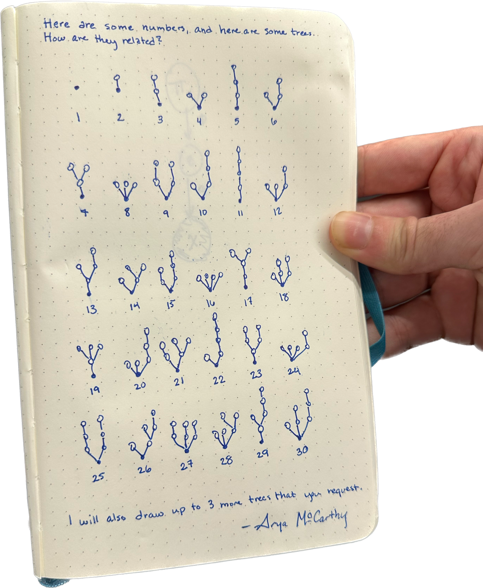

The first thing that stuck out to me was the powers of two all looked very similar. They were all a single level deep with the number of child nodes equal to the power of two.

I then noticed that 6 kind of looked like a 3 and a 2 side by side. This also works for the powers of two. Maybe all composite numbers are represented by trees for each of their prime factors.

That leaves the primes. This was definitely the hardest part to notice. But after staring at it for a while I noticed that 7 and 4 looked alike. 7 was basically a 4, but extended by one node. 7 is also the 4th prime. Checking to see if that works. 2 is the first prime and 2 extended by one. 3 is the second prime and 3 looks like 2 extended by one.

Cute!

