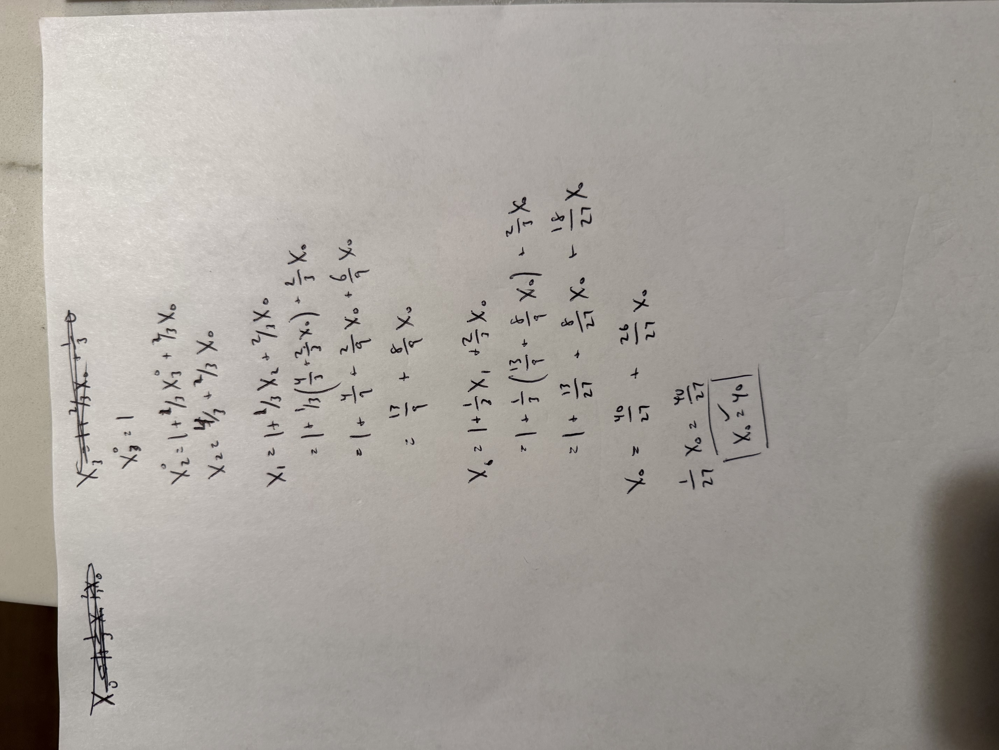
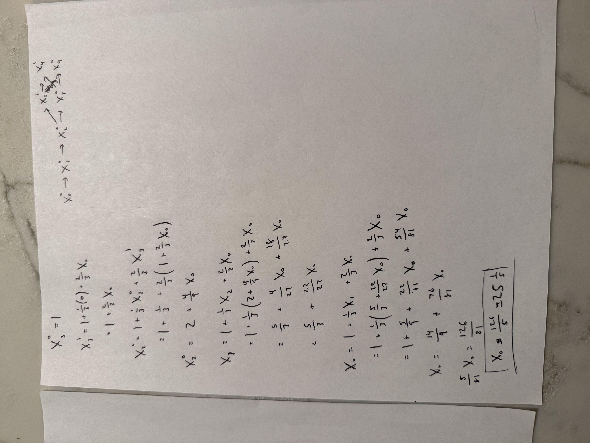
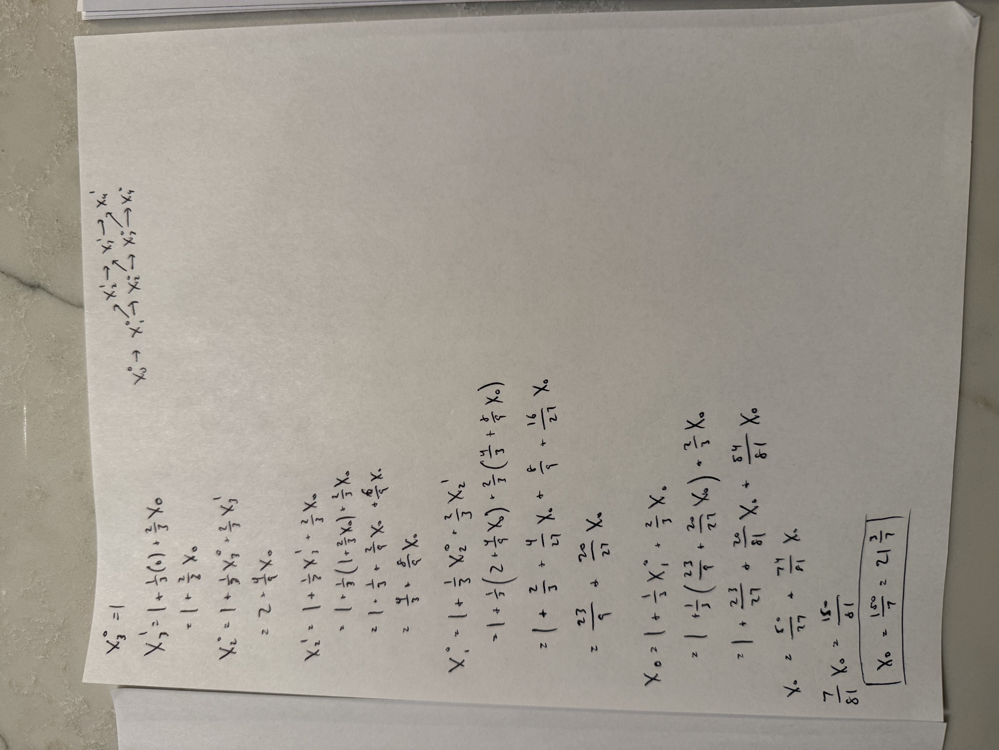
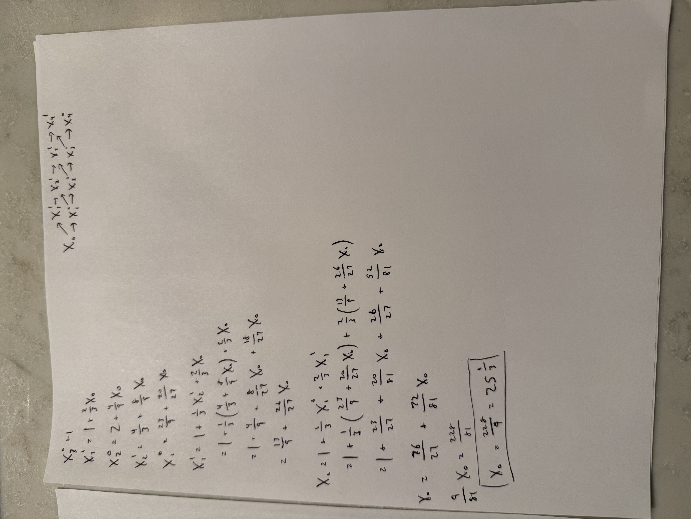

The optimal solution is to stop early if the first song contains a mistake, but otherwise never stop early. In expectancy, the total number of songs the student will need to play is 21 3/7.

Here's my work:

The expected number of songs if you stop early after a mistake on the first, second, or third song is 40:

The expected number of songs if you stop early after a mistake on the first or second song is 25 1/5:

The expected number of songs if you stop early after a mistake on the first song is 21 3/7:

The expected number of songs if you never stop early is 25 1/3:

