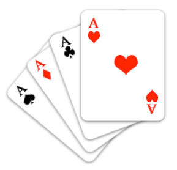

We are going to play a card game.  I will shuffle a standard deck of 52 cards and then flip over two cards at a time.

- If the two cards are red, you get them in your pile.
- If the two cards are black, I get them in my pile.
- If the cards are one red and one black, we will put them into a side pile.

Once I am through the entire deck, you count your pile and I will count mine.  If you have more cards in your pile than I have in mine, I will pay you $100.

What is the most that you would pay to play this game?
