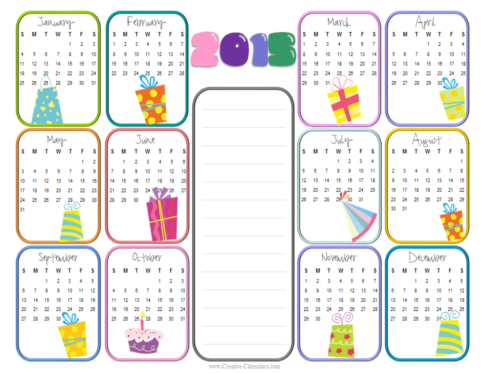

This is not your <a href="../birthday-problem/question.html">classic birthday problem</a>.  This one is a bit tricker:

Suppose you have a group of n random people.  What's the smallest n such that the probability that you can celebrate someone's birthday on every day of the year is greater than 50%?

