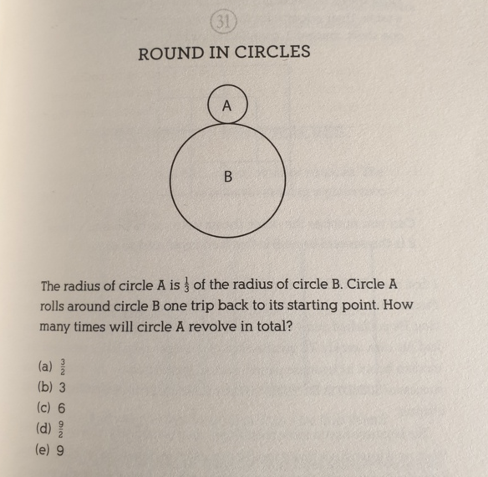

This question actually has an interesting backstory.  It's actually an SAT question from 1982 and here is the full question, including the answer choices:

But the correct answer is 4!

See this 1984 NY Times article [Error Found in SAT Question](https://www.nytimes.com/1982/05/25/us/error-found-in-sat-question.html).

