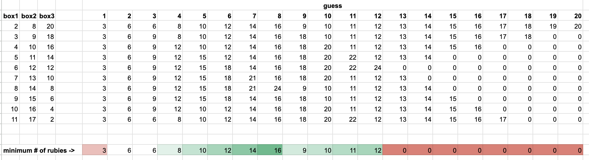

<link rel="stylesheet" href="/assets/fullscreen/fullscreen.css" />

I kind of cheated and just brute forced the solution for this one. I enumerated every possible way the scoundrel could put the rubies in the box following the rules. These are the ways.

| box1 | box2 | box3 |
| ---- | ---- | ---- |
| 2    | 8    | 20   |
| 3    | 9    | 18   |
| 4    | 10   | 16   |
| 5    | 11   | 14   |
| 6    | 12   | 12   |
| 7    | 13   | 10   |
| 8    | 14   | 8    |
| 9    | 15   | 6    |
| 10   | 16   | 4    |
| 11   | 17   | 2    |

And then, for each I used google sheets to compute the number of rubies I would get for every possible guess for each of those. It's a lot to show so here's a screenshot.

Notice that if you guess 8 for each box you will win 16 rubies no matter how the scoundrel puts the rubies in teh box.
