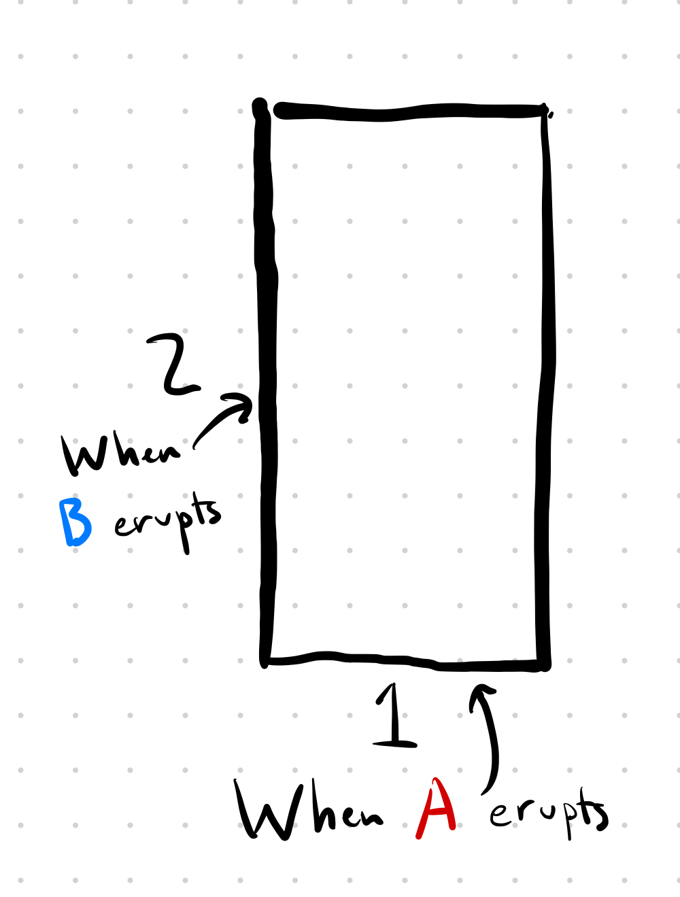
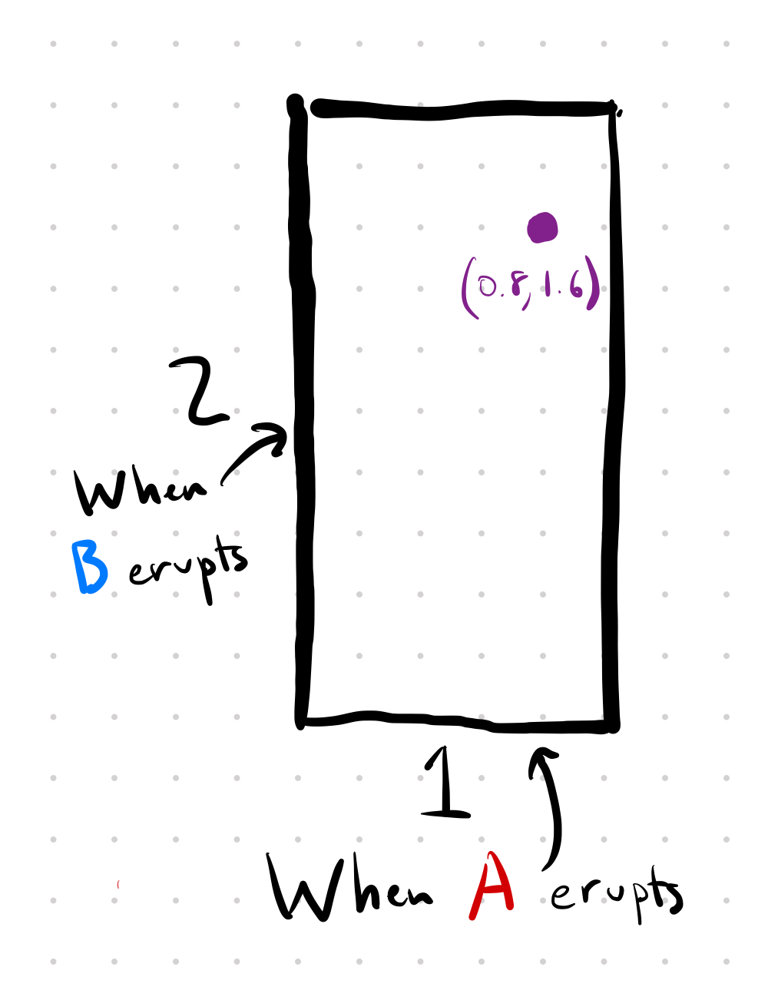
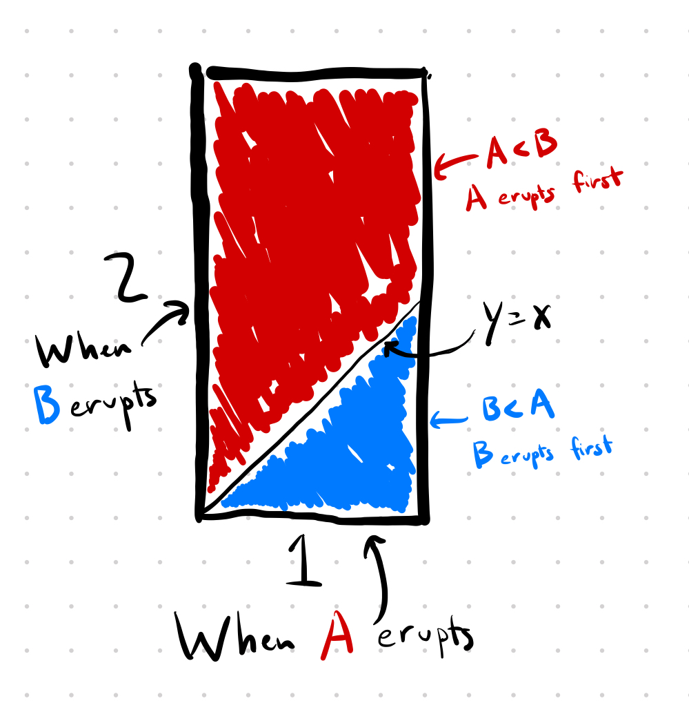
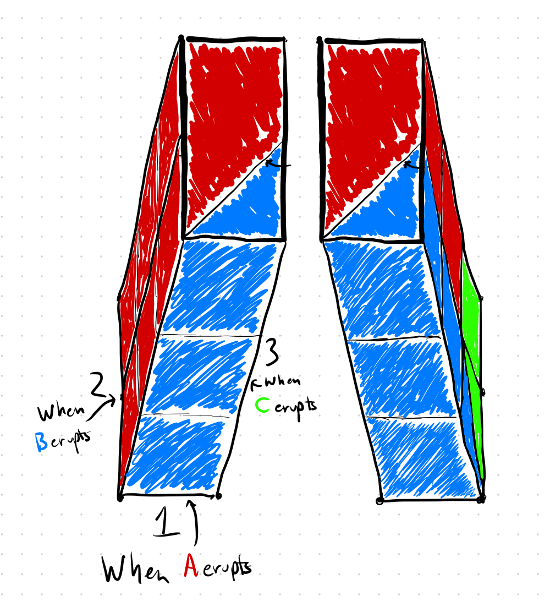

$$
\begin{align*}
A &= 23/36 \\
B &= 8/36 \\
C &= 5/36 \\
\end{align*}
$$

You can read Presh Talwalkar's solution [here](https://mindyourdecisions.com/blog/2018/05/17/the-three-erupting-geysers-probability-riddle/).

## My solution

First things first, geysers every 2, 4, and 6 hours is no different than 1, 2, and 3, and those are easier to work with, so for my solution I'm assuming A, B and C erupt every 1, 2, and 3 hours respectively.

### Just 2 geysers

To start, let's simplify the problem and consider the case with just two geysers A and B which erupt every 1 and 2 hours respectively. 

We arrive at the park and have no idea when each geyser will erupt, but we know that geyser A will erupt sometime between now and 1 hour from now, uniformly distributed over that time interval, and geyser B will erupt sometime between now and 2 hours from now, also uniformly distributed over that time interval.  Furthermore, the question said the geysers erupt independently.

We can visualize this as a 1x2 rectangle where the x-axis represents when A will erupt next and the y-axis represents when B will erupt next.  Like so: 

Just to make sure you understand what this represents, consider the point (0.8, 1.6):

That point represents the outcome where A erupts after 0.8 hours and B erupts after 1.6 hours.

We can shade the rectangle according to which geyser will erupt first.  The red region is when A < B and therefore A erupts first.  The blue region is when B < A and therefore B erupts first.  Notice that the dividing line between the two regions is when y = x.

To compute the probability B arrives first, all we need to do is compute the area of the blue region and divide by the total area of the rectangle: $$\frac{1/2}{2} = \frac{1}{4}$$.  Likewise for the probability that A arrives first: $$\frac{3/2}{2} = \frac{3}{4}$$.

### Now with 3 geysers

We can solve the real problem (with all 3 geysers A, B, and C) in exactly the same way.  It's just much harder to visualize since it's in 3D.

Instead of a 1x2 rectangle, we need a 1x2x3 box.  I'd attempted to draw the shape from two different angles.  Like in the 2D case, I colored each point as red if A erupts first, blue is B erupts first, and green if C erupts first:

I'm not good at drawing, but also it's kind of hard to get a sense of how the *inside* of the box is colored just by looking at the outside, here's a video of the same shape but I've shunk each 1x1x1 cube so that you can effectively look inside the box:

	<video controls="controls" width="500" height="500" name="Video Name">
		<source src="./rectangular-prism.mov">
	</video>

