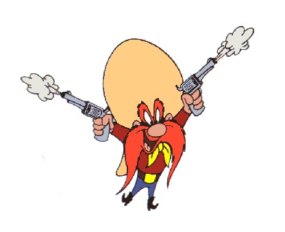

In an early morning, three rivals get together on an open spot in a dark wood to compose a quarrel by means of guns. A kind of duel, but with three persons: A, B and C. The rules of the game are:

- They draw lots who may fire first, second and third.
- Next, they will continue firing at each other in this order until only a single person is alive.
- Every person decides himself at which person he fires.
- Everyone knows that A hits (kills) in 100% of all shots, B hits (kills) in 80% of all shots and C hits (kills) in 50% of all shots.
- Each person chooses his ideal strategy.
- No one is killed by a stray bullet.

Who has the largest chance of surviving the truel, and how big is this chance?
