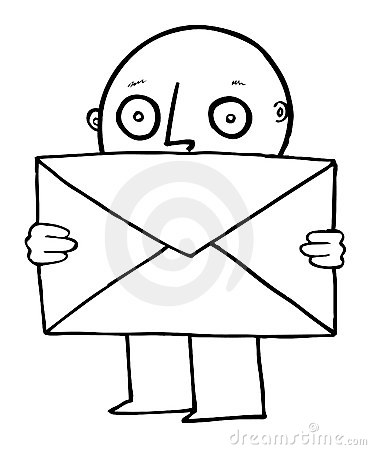

This is a variation on the standard two envelope problem.  If you've never heard it, I suggest you start <a href="https://en.wikipedia.org/wiki/Two_envelopes_problem">here</a>.

There are two envelopes.  Each envelope has some amount of money in it.  The amounts in the two envelopes are different.  You are handed one envelope.  Each envelope has a 50% chance to be handed to you.  You open the envelope and see the amount inside.  Then you're ofference the chance to switch envelopes.  Your goal is to end up with more money.

Can you come up with a strategy which has a greater than 50% chance of ending up with the envelope with more money?

P.S.  If you start down the road of "I'll weigh the envelopes" or "Maybe I can see through the envelopes", stop...
