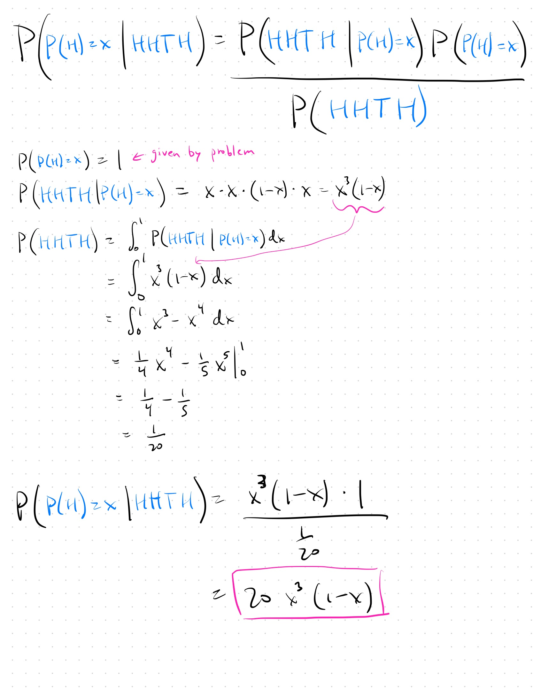
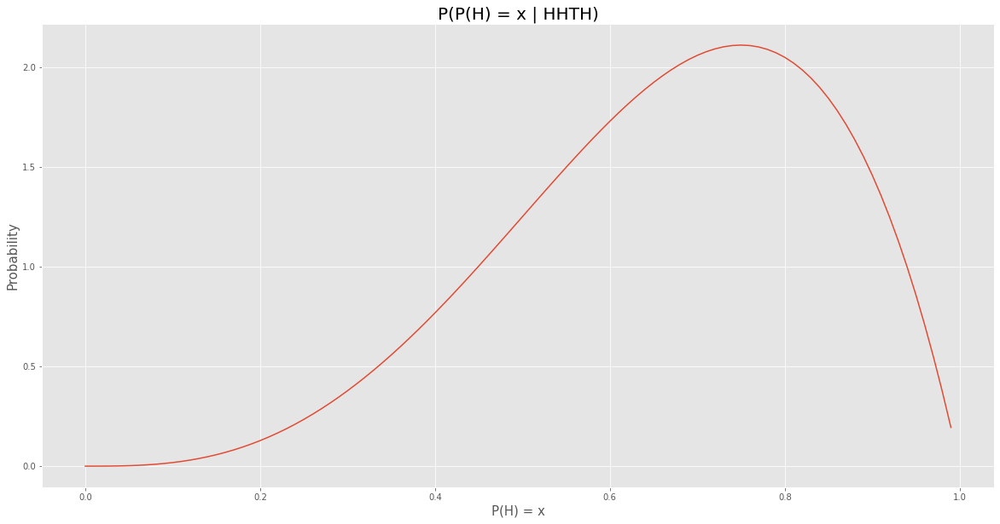

Really all this problem is testing is whether you can apply Bayes rule. The one part that makes it slightly tricky is that all the probability distributions are continuous (as opposed to discrete).

Let's do it:

And if you want to see what that actually looks like:

  

To answer the question of "what is the most likely P(H)?" we can just take the derivative of $$20x^3(1-x)$$ and set that equal to zero to find that, 3/4 is the most likely value. 3/4 also happens to be the fraction of heads we say empirically in our HHTH sequence.
