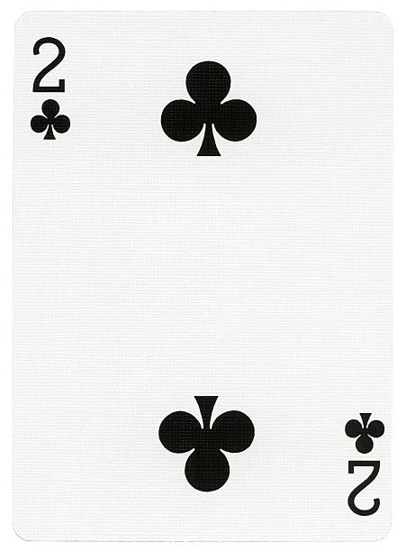
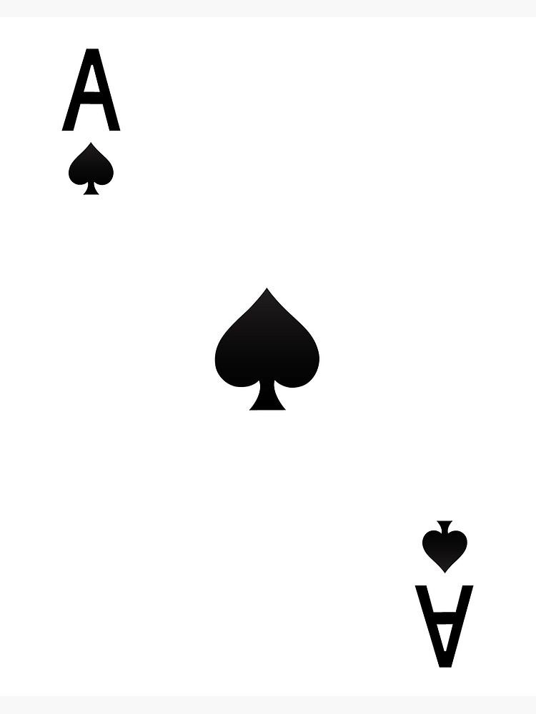
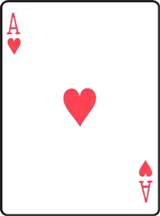
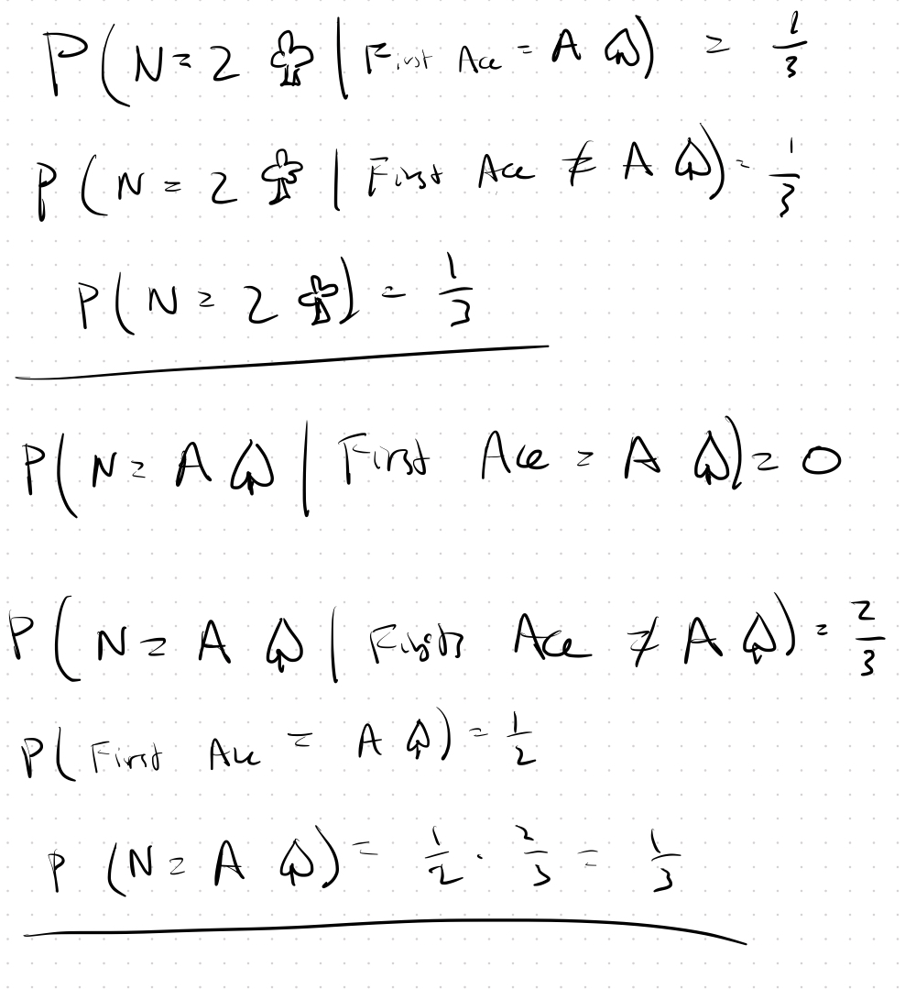

If you said the two of clubs was more likely... think again!

You can view Presh Talwalkars solution [here](https://www.youtube.com/watch?v=316GRjuKgT0).

The answer is... they are equally likely!  I found this incredibly counter-intuitive.

At first it seems the two of clubs should be more likely. If the first
ace is not the ace of spades, then either card should be equally
likely. But if the first ace is the ace of spades, then only the two
of clubs can appear. So there should be more ways for the two of
clubs. However, this intuition is wrong.

Why is it wrong? It's this part: 

> If the first ace is not the ace of spades, *then either card should be equally likely.*

If the first ace is not the ace of spades then we know the ace of spades comes after the first ace and so it's more likely than 1/52 that the next card is the ace of spades.

Let's work through a simplified example where there is just a 3-card deck: two aces and the 2 of clubs.

    
     
    
    
     
     

Notice that in the 3 cases where the first ace is *not* the ace of spades, the ace of spades is the next card in 2/3 of them (not 1/3 of them).  Armed with that intuition, it's easy to show that they're equally likely:

