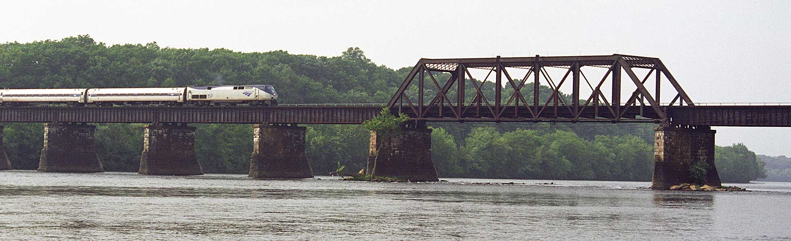

Gordie Lachance is crossing a train bridge when he hears a train’s whistle rapidly approaching from behind.  At the time he is 1/4 of the way across the bridge.

If he turns around and runs back towards the train, he will just barely make it off the bridge as the train arrives at the start of the bridge.  If he continues to run away from the train, he will also just barely make it to the other side when the train reaches the other side of the bridge.

What is the relative speed of Gordie to the train?
